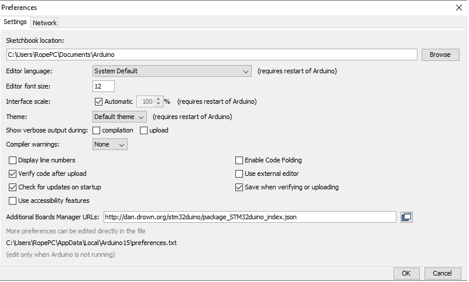
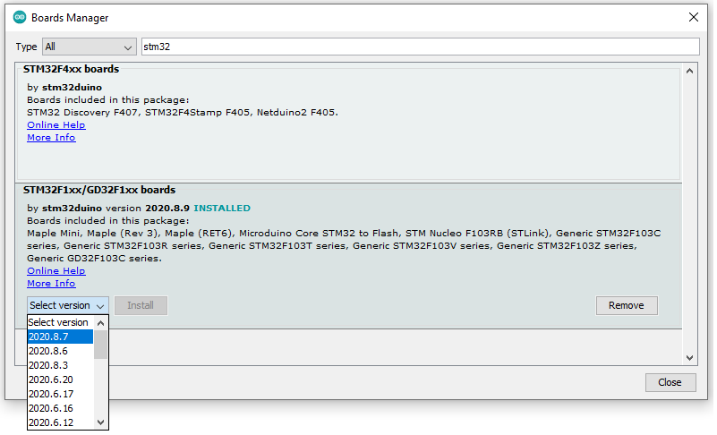

About S-Drive project
=======================================

.. meta::
   :description lang=en: Arduino IDE setup for S-Drive firmware

Firs download Arduino IDE from official website: 
(Version we are running is 1.8.13)

Run Arduino IDE, go to file/preferences/additional boards manager urls:
Enter : http://dan.drown.org/stm32duino/package_STM32duino_index.json
(Any additional json file is sepperated with ,)

Now go to tools/board/board manager and search for STM32
Select STM32F1XX/GD32F1XX BOARDS
(We used version 2020.8.9.)

