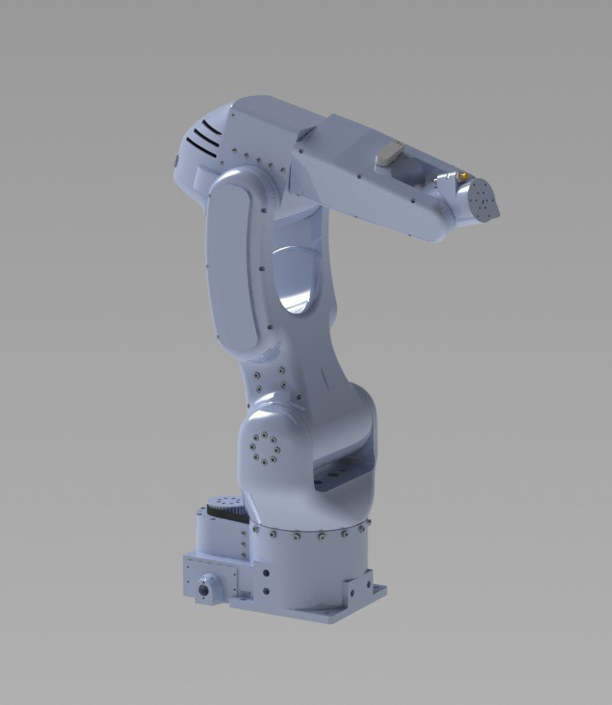

About Faze4
===========================

.. meta::
   :description lang=en: General info about Faze4 robotic arm.

Faze4 robotic arm came to be when i made a working 3d printable cycloidal gearbox and saw some potential in it. After that i designed whole arm around it. It uses 6 stepper motors, so it is a 6 axis robot arm. While designing this arm i focused on low backlash and good design of arm. All wires are hidden and arm is really rigid even tho it is 3d printed. Total cost of the arm is around 1000 - 1500 dollars.

.. note::

    This project is still work in progres. Part that is work in progres is control cabinet, that means that the arm can be built and it     will work without the cabinet.

Esthetic design was inspired by FANUC’s LR Mate 200iD. 
Goal was also to hide all wires in the arm like most industrial arms do. 
Only visible wires (or pipes) would be ones for gripper. 

Weight of the arm is around 14-15 kg , but it can be reduced by printing with less infill.

Low level control for the arm runs on teesny 3.5, while high level (inverse kinemtaics, simulations) are only on Matlab code atm, but I am working on ROS implementation and porting my Matlab code to Python.

Table of contents
-----------------

On this read the docs page you will find:

* How is arm desing and desing decisions
* Printing tips
* Electronics guide and PCB
* Building instructions for the arm
* All code and programs used
* How to test and troubleshoot
* Sources 
* Where to buy parts

Support the project
-------------------

This project is completely Open source and free to all and I would like to keep it that way, so any help 
in terms of donations or advice is really appreciated. Thank you!

.. image:: ../docs/images/PayPal-Donate-Button-PNG-Clipart.png
   :width: 250
   :target: https://www.buymeacoffee.com/Blestron

    
