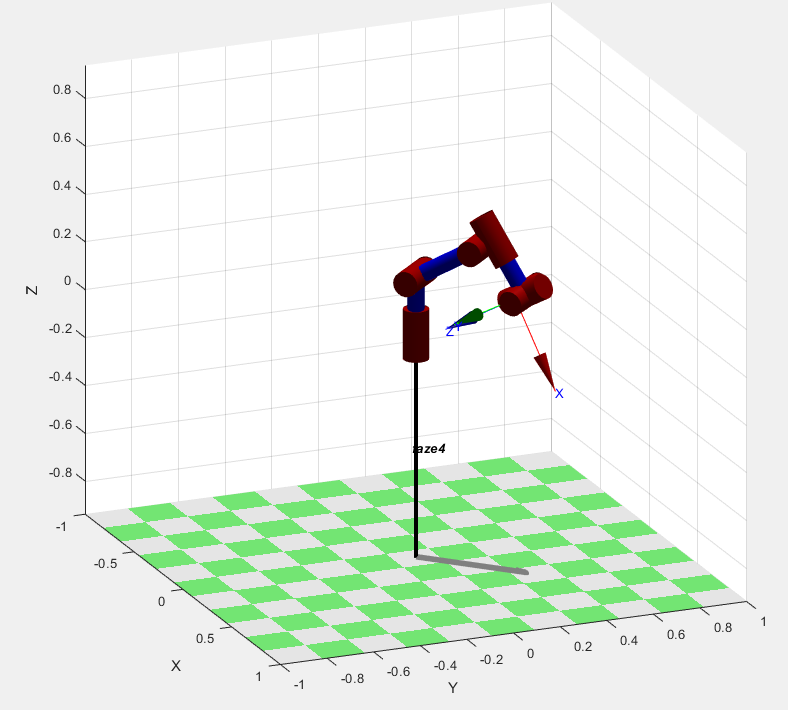
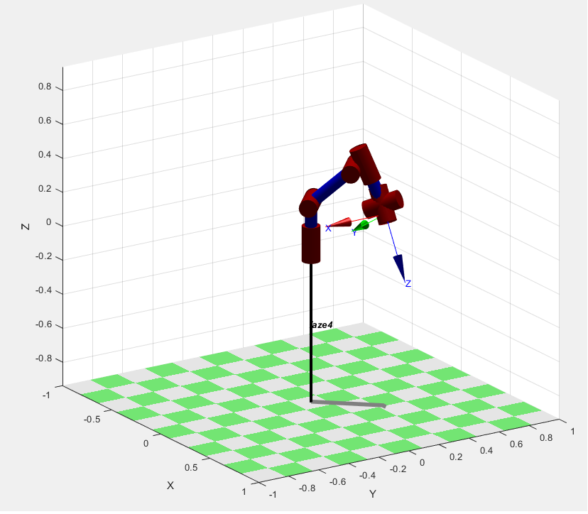
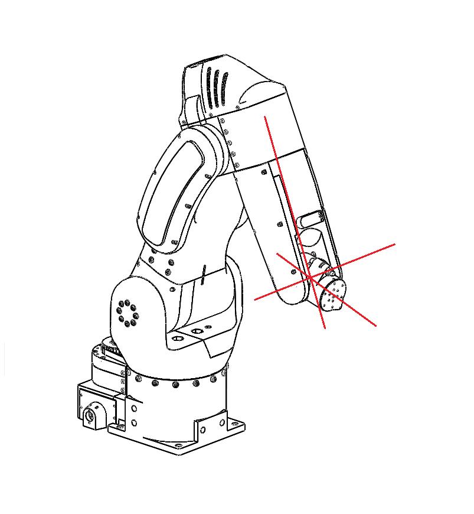

Design decisions
===========================

.. meta::
   :description lang=en: Design decisons that were made when designing faze4 arm.

Number of axis
--------------

I went with 6 axis because with 6+ axis we can reach same dot in space with different orientations.
Both pictures show arm at position x=0.3m , y=0.3m and z=0.2m but as you can see orientations are different. 

Spherical wrist
---------------

This arm uses so called spherical wrist. Spherical wrist is configuration of joints where axes of rotation for joints 4,5,6 intersect.
You can see that in picture below. You will see this configuration in a lot industrial robot arm. 

