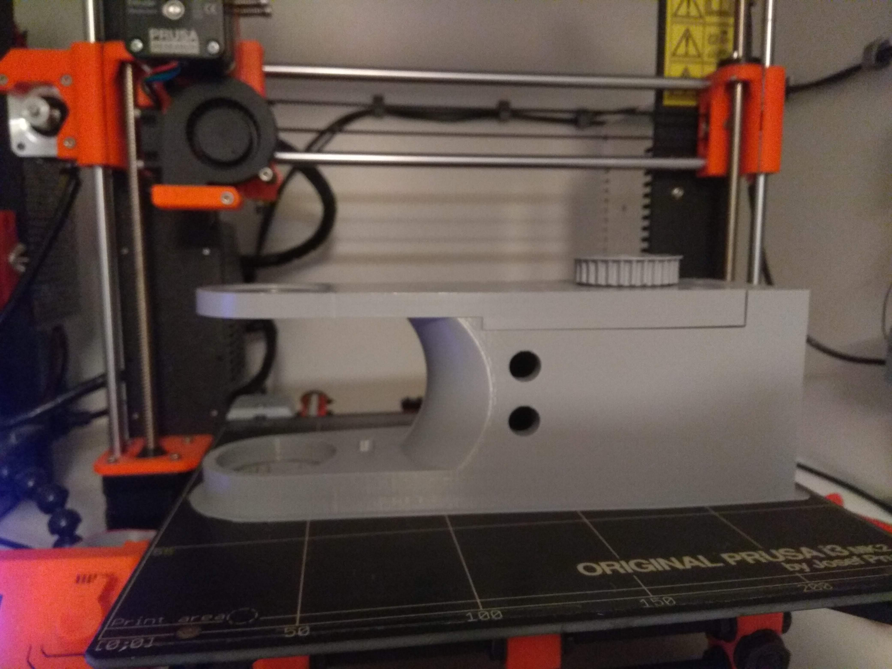

Electronics and PCB
===========================

.. meta::
   :description lang=en: info about Electronics and PCB.
   
All electronics can also be bought from ebay and similar sites. 

.. Tip::

   From experiance i found out that cheaper stepper drivers tend to make more noise, so if you want quiet robot arm buy more expensive      drivers.

BOM
------------
You can find bom in this excel document and in building instructions file. 

.. Tip::

   I also recommend to buy more items like bearinngs and screws than you need since you might destroy or damage some in building            process.

