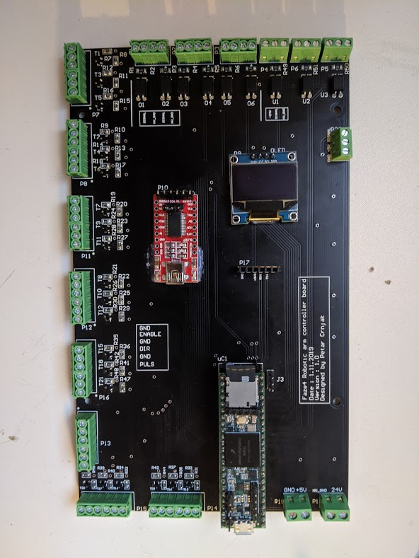

Electronics and PCB
===========================

.. meta::
   :description lang=en: info about Electronics and PCB.
   
All electronics can also be bought from ebay and similar sites. 

.. Tip::

   From experiance i found out that cheaper stepper drivers tend to make more noise, so if you want quiet robot arm buy more expensive      drivers.

PCB V1
------------
This PCB is first version and has some errors that will be fixed in revision 2.
Board was created in Altium Circuitmaker and all files can be found here:
https://github.com/PCrnjak/Faze4-Robotic-arm/blob/master/Distribution_PCB.zip

Upper section of PCB are Inputs for limit switches and inductive sensors. All inputs on top are isolated with optocouplers. I did that since all wires of the arm are going thur same spot, that means "high voltage" stepper wires were near low voltage limit switch wires. That caused promblems where steppers induced enough voltage to trigger interupts on teensy. That is why limit switches and sensors are connected to 24v. left side is for stepper outputs. There are also 2 stepper outputs on bottom right side.

Bottom right side has 5V input and 24V input. You need both for arm to work. In the middle we have few extra serial ports and OLED display.

