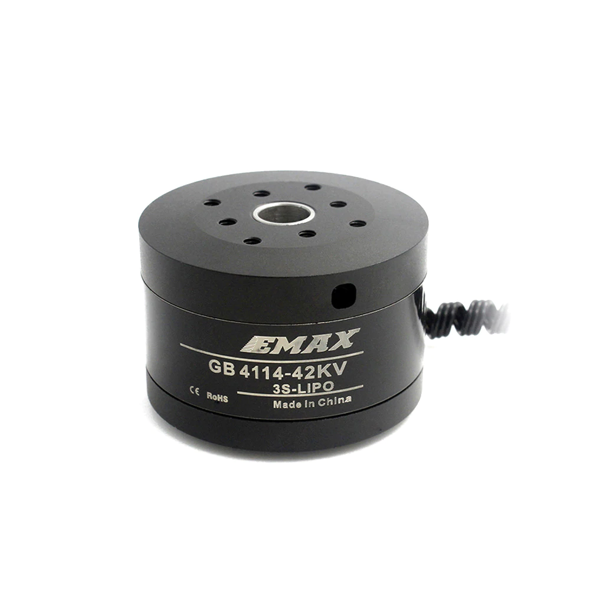
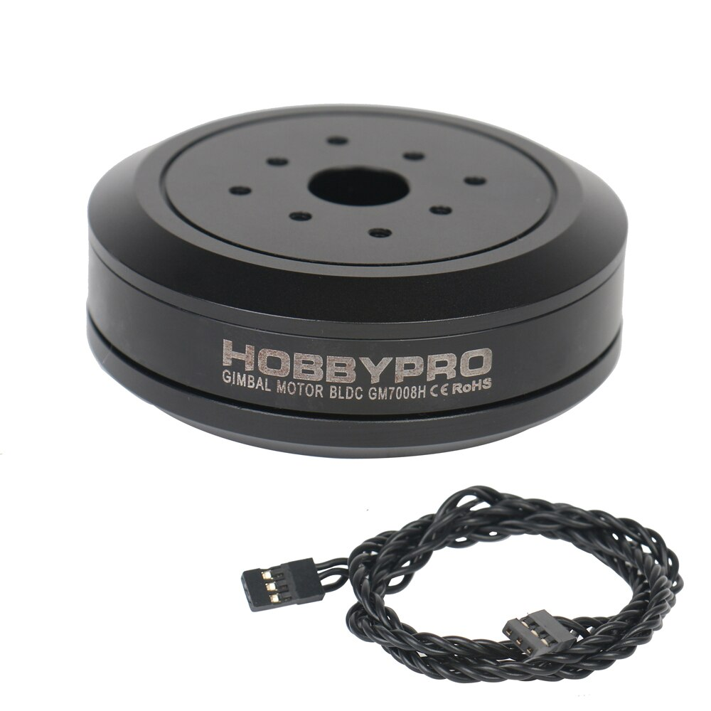

Tested Motors
=======================================

.. meta::
   :description lang=en: Tested motors
   

   
GB4114 Brushless Motor
--------------------------

      
+----+------------+------------+
| kv | Pole pairs | Resistance |
+----+------------+------------+
| 28 | 11         | 10.3 Ohm   |
+----+------------+------------+

GM7008H Brushless Motor
--------------------------

      
+----+------------+------------+
| kv | Pole pairs | Resistance |
+----+------------+------------+
| 42 | 11         | 10.8 Ohm   |
+----+------------+------------+
